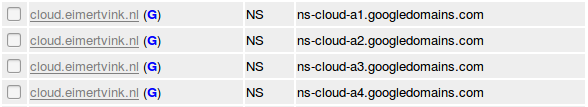
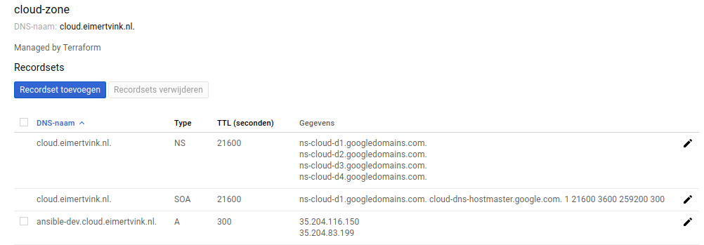

# terraform-google-compute-engine-instance

Create virtual machines on Google Cloud. With DNS A record for easy access. Published in the [Terraform registry](https://registry.terraform.io/modules/Eimert/compute-engine-instance/).

- Separated disk and static ip for better manageability
- Substitutes `$$REGION` and `$$ZONE` in user-data

## Usage example:

Creates instances with public IP addresses. Machine type can be changed without destroying the boot disk.

1. Create a new directory for this terraform configuration
2. Create a main.tf, for example:
```ruby
# Spin up VMs on compute engine

# Configure the Google Cloud provider
provider "google" {
  credentials = "${file("king-of-my-google-cloud-castle.json")}"
  project     = "smashing-dash-1992"
  version     = "~> 1.8"
}

# Configuring DNS is optional, values can be left as-is
resource "google_dns_managed_zone" "managed_zone" {
  # descriptive name for dns zone
  name     = "cloud-zone"
  # requires last dot. Ex.: prod.example.com.
  dns_name = "cloud.eimertvink.nl."
}

module "gc1" {
  source          = "github.com/Eimert/terraform-google-compute-engine-instance"
  amount          = 1
  region          = "europe-west4"
  zone            = "europe-west4-c"
  # hostname format: name_prefix-amount
  name_prefix     = "vm"
  machine_type    = "custom-2-4096"
  disk_type       = "pd-ssd"
  disk_size       = "15"
  disk_image      = "centos-cloud/centos-7"

  dns_managed_zone_name_indicator = "${google_dns_managed_zone.managed_zone.name}"
  dns_zone_name   = "${google_dns_managed_zone.managed_zone.dns_name}"
  dns_record_name = "ansible-dev"

  user_data       = "firestone-lab"
  username        = "eimert"
  public_key_path = "~/.ssh/id_rsa.pub"
}

```
3. ```terraform init```
4. ```terraform plan``` Boom! Credentials file missing.
5. Add your google cloud credentials in a .json file. [Getting started guide](https://www.terraform.io/docs/providers/google/getting_started.html#adding-credentials)

> Keep the Google Cloud credentials in a safe place. Don't push them to Git.

6. Adapt the Terraform variables in `main.tf` to match your Google cloud project name, and VM requirements. All optional parameters can be found in [variables.tf](./variables.tf).
5. Let terraform fire up the VM's:
```bash
terraform apply
```
6. Wait a few minutes.
7. Connect using SSH (private key auth): `ssh -i <private key> <username>@<ip from output>`. Or: `ssh eimert@ansible-dev.cloud.eimertvink.nl`.
8. Break down the resources:
```bash
terraform destroy
```

## machine_type
Overview of choices for variable machine_type.
```
f1-micro
g1-small

n1-standard-1
n1-standard-2
n1-standard-4
n1-standard-8

n1-highmem-2
n1-highmem-4
n1-highmem-8

n1-highcpu-2
n1-highcpu-4
n1-highcpu-8
```
Values are derived from [Google cloud console REST API call examples](https://console.cloud.google.com/compute/instancesAdd). Click for CPU and memory details.

## DNS

The subdomain cloud.eimertvink.nl is configured with Google' nameservers:<br>


This terraform plan creates an DNS A record for VMs. When (VM) `amount = 2`, this results in:<br>

<br>
If you want a unique (sub-)subdomain for every VM, use multiple TF module calls:
```ruby
module "gc1" {
  (..)
  dns_record_name = "ansible-dev"
  (..)
}

module "gc2" {
  (..)
  dns_record_name = "ansible-tst"
  (..)
}
```
